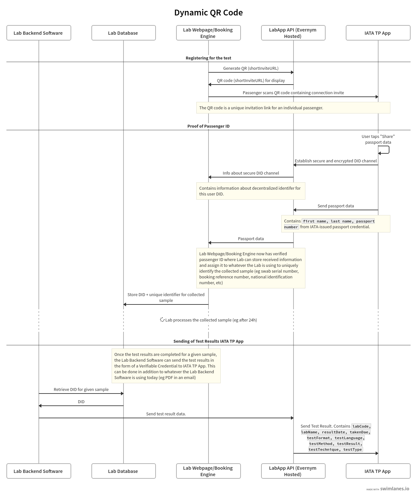
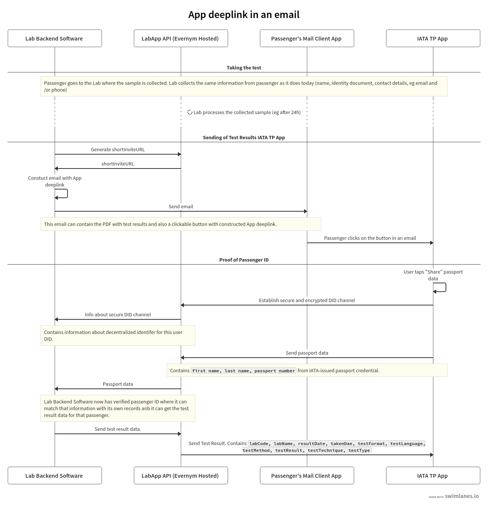
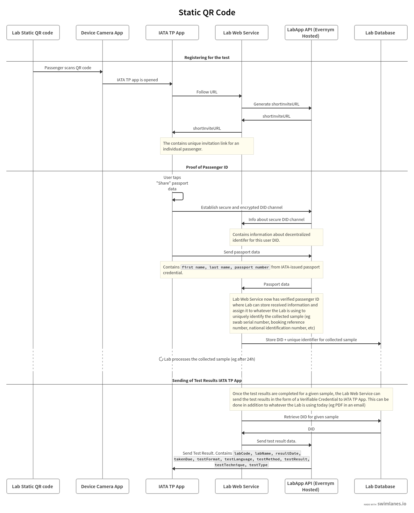

**[Introduction](#introduction) 2**

**[Requirements](#requirements) 2**

**[API Specification](#api-specification) 2**

**[Step by step - Integration](#step-by-step---integration) 2**

> [Updating the Endpoint](#updating-the-endpoint) 2
>
> [Generating the QR Code and Connecting to the
> Passenger](#generating-the-qr-code-and-connecting-to-the-passenger) 3
>
> [Receiving the passenger
> information](#receiving-the-passenger-information) 8
>
> [Sending Test Results as Verifiable
> Credentials](#sending-test-results-as-verifiable-credentials) 12

**[Integration types](#integration-types) 24**

**[Option 1 - Dynamic QR codes](#option-1---dynamic-qr-codes) 24**

> [High level sequence](#high-level-sequence) 25

**[Option 2 - App deeplink](#option-2---app-deeplink) 26**

> [High level sequence](#high-level-sequence-1) 27
>
> [Constructing the App deeplink](#constructing-the-app-deeplink) 28

**[Option 3 - Static QR codes](#option-3---static-qr-codes) 29**

> [High level sequence](#high-level-sequence-2) 29

**[Useful links](#useful-links) 32**

Introduction
============

This document is intended for laboratories and health clinics participating in the IATA Travel Pass program who want to integrate with LabApp APIs for issuing Covid19 test results as verifiable credentials to IATA Travel Pass users.

Requirements 
============

In order to integrate with LabApp API, you'll need following:

1.  **Api Key** - You'll receive DomainDID and apiKey that you'll be using when making API requests. DomainDID and apiKey are different for nonPROD/DEMO and PROD.
    
2.  **API URL** - For PROD it is: [https://vas.evernym.com](https://vas.evernym.com) while for nonPROD/DEMO it is [https://vas.pps.evernym.com](https://vas.pps.evernym.com)
    
3.  **Publicly accessible endpoint** - LabApp API is asynchronous and requires a client to stand up a publicly accessible endpoint to be able to receive responses from the LabApp API. During testing/exploration, you can use some of the available online service, eg requestbin.com or ngrok.
    
4.  **CredDefId** - You'll receive a CredDefId that you'll be using when issuing Test Results to passengers, eg RJKT4MttvW1U3JXDR3V1mE:3:CL:179684:latest. You'll receive a different CredDefId for PROD and nonPROD/DEMO.
    
5.  **Lab Name and Lab Code** - *ONLY required for production use*. These are the values that are part of the Test Result and those are being assigned by IATA's Lab Registry. For nonPROD/DEMO, you can use some dummy data for these values.

API Specification
=================

Swagger for LabApp API can be found here:

[https://app.swaggerhub.com/apis/evernym/verity-rest-api/1.0](https://app.swaggerhub.com/apis/evernym/verity-rest-api/1.0)

You can find a list of common error codes here:
[https://gitlab.com/evernym/mobile/mobile-sdk/-/blob/main/docs/Errors.md](https://gitlab.com/evernym/mobile/mobile-sdk/-/blob/main/docs/Errors.md)

Step by step - Integration
==========================

Updating the Endpoint
---------------------

This is the API call where you'll be registering the endpoint for receiving asynchronous responses from the LabApp API. *This is called
ONLY once*.

Example of the call:

[https://app.swaggerhub.com/apis/evernym/verity-rest-api/1.0\#/UpdateEndpoint/updateEndpoint](https://app.swaggerhub.com/apis/evernym/verity-rest-api/1.0#/UpdateEndpoint/updateEndpoint)

Example of request:

```json
POST https://vas.pps.evernym.com/api/<Domain DID>/configs/0.6/
x-api-key: <apiKey>
{
  "@id": "e3692334-2447-4184-8c03-314603793bb7",
  "@type": "did:sov:123456789abcdefghi1234;spec/configs/0.6/UPDATE_COM_METHOD",
  "comMethod": {
    "id": "webhook",
    "value": "https://enazy4stgnrep.x.pipedream.net",
    "type": 2,
    "packaging": {
      "pkgType": "plain"
    }
  }
}
```

Example of the response that you’ll receive on your webhook:

```json
{
    "id": "webhook",
    "@type": "did:sov:123456789abcdefghi1234;spec/configs/0.6/COM_METHOD_UPDATED"
}
```


Generating the QR Code and Connecting to the Passenger
------------------------------------------------------

In order to register the passenger for the test, and communicate securely with them, you'll need to create a new unique decentralized identifier (DID) for this passenger relationship, and store it for further communications. This DID lets you reference this passenger relationship later when sending test results.

Creating this new DID is done by calling the API with the "relationship" request.

API call:

[https://app.swaggerhub.com/apis/evernym/verity-rest-api/1.0\#/Relationship/relationship](https://app.swaggerhub.com/apis/evernym/verity-rest-api/1.0#/Relationship/relationship)

For reference, more detail about DID exchange [can be found here](https://github.com/evernym/verity-sdk/blob/master/docs/verity-architecture/Generic_DID_Exchange__Connecting__Protocol_-_Verity_2.0.png).

Example of request:

```json
POST https://vas.pps.evernym.com/api/<Domain DID>/relationship/1.0/8caf39be-0dbf-480d-b3c0-a778fa459901
x-api-key: <apiKey>

{
  "@id": "0729a580-2240-11e6-9eb5-0002a5d5c51p",
  "label": "Example Lab",
  "logoUrl": "http://example.com/logo.png", 
  "@type": "did:sov:123456789abcdefghi1234;spec/relationship/1.0/create"
}
```

> **NOTE:** 
> threadId (8caf39be-0dbf-480d-b3c0-a778fa459901) is being used to match the response with the request
>
> Label is used to display name of the Lab

Example of the response that you’ll receive on your webhook:

```json
{
    "did": "7tQVqSUNUT5YHBSzB58vtX",
    "verKey": "4kgz2w4UDvaVhC8wKmzbvGjwJKhamKG2j7Uoch5pT59f",
    "@type": "did:sov:123456789abcdefghi1234;spec/relationship/1.0/created",
    "@id": "e6f661fb-1e04-4f51-bdde-78b94b5ea557",
    "~thread": {
        "thid": "8caf39be-0dbf-480d-b3c0-a778fa459901"
    }
}
```

> **NOTE:**
>  ~thread, thid - contains the threadId from the request.
>
> DID: 7tQVqSUNUT5YHBSzB58vtX is the lab’s unique decentralized identifier for this particular passenger. You should store this for further communications.

Once this is done, another call is made to create and retrieve the shortURL that is displayed as a QR code which passengers scan using their IATA Travel Pass app.

Also embedded in this invitation is a request for the passenger to prove their name and passport number, so this is a combined "connect-and-prove" transaction.

You'll need to make following call:

[https://app.swaggerhub.com/apis/evernym/verity-rest-api/1.0\#/PresentProof/requestProof](https://app.swaggerhub.com/apis/evernym/verity-rest-api/1.0#/PresentProof/requestProof)

Example of request:

```json
POST https://vas.pps.evernym.com/api/<Domain DID>/present-proof/1.0/8caf39be-0dbf-480d-b3c0-a778fa459915
x-api-key: <apiKey>
{
  "@type": "did:sov:BzCbsNYhMrjHiqZDTUASHg;spec/present-proof/1.0/request",
  "@id": "e3692334-2447-4184-8c03-314603793bb8",
  "~for_relationship": "7tQVqSUNUT5YHBSzB58vtX",
  "name": "Travel Pass Id",
  "proof_attrs": [
    {
      "name": "givenNames",
      "restrictions": [{"cred_def_id": "RwSuTfckvgWjXTXwiTVFtP:3:CL:58011:latest"}, {"cred_def_id":"RwSuTfckvgWjXTXwiTVFtP:3:CL:58011:latest-mrz"}],
      "self_attest_allowed": false
    },
    {
      "name": "lastName",
      "restrictions": [{"cred_def_id": "RwSuTfckvgWjXTXwiTVFtP:3:CL:58011:latest"}, {"cred_def_id":"RwSuTfckvgWjXTXwiTVFtP:3:CL:58011:latest-mrz"}],
      "self_attest_allowed": false
    },
    {
      "name": "number",
      "restrictions": [{"cred_def_id": "RwSuTfckvgWjXTXwiTVFtP:3:CL:58011:latest"}, {"cred_def_id":"RwSuTfckvgWjXTXwiTVFtP:3:CL:58011:latest-mrz"}],
      "self_attest_allowed": false
    }
  ],
  "proof_predicates": [],
  "by_invitation": true
}
```

> **NOTE:**
>
> threadId (8caf39be-0dbf-480d-b3c0-a778fa459915) is being used to match the response with the request
>
> “~for_relationship” - you’ll need to use the Did value from the previous response
>
> “name” - has to be “Travel Pass Id” for the Travel Pass app to work correctly
>
> “proof_attrs” section has to be like the one in the example for PROD.
>
> For nonPROD/DEMO, you can have following instead:
>
> "proof_attrs": [
>
> ​    {
>
> ​     "name": "givenNames",
>
> ​     "restrictions": [],
>
> ​     "self_attest_allowed": true
>
> ​    },
>
> ​    {
>
> ​     "name": "lastName",
>
> ​     "restrictions": [],
>
> ​     "self_attest_allowed": true
>
> ​    },
>
> ​    {
>
> ​     "name": "number",
>
> ​     "restrictions": [],
>
> ​     "self_attest_allowed": true
>
> ​    } 
>
> ]


Example of the response that you’ll receive on your webhook:

```json
{
    "inviteURL": "https://vas.pps.evernym.com:443/agency/msg?oob=eyJsYWJlbCI6IklBVEEgTGFiIFRlc3QgMiIsImdvYWxfY29kZSI6Imlzc3VlLXZjIiwiZ29hbCI6IlRvIGlzc3VlIGEgY3JlZGVudGlhbCIsInNlcnZpY2UiOlt7ImlkIjoiN3RRVnFTVU5VVDVZSEJTekI1OHZ0WDtpbmR5IiwidHlwZSI6IkluZHlBZ2VudCIsInJlY2lwaWVudEtleXMiOlsiNGtnejJ3NFVEdmFWaEM4d0ttemJ2R2p3SktoYW1LRzJqN1VvY2g1cFQ1OWYiXSwicm91dGluZ0tleXMiOlsiNGtnejJ3NFVEdmFWaEM4d0ttemJ2R2p3SktoYW1LRzJqN1VvY2g1cFQ1OWYiLCJFeFBGTHg0dU5qRjlqUlFKVjdYeEF0OE1mdVhKRU5nYmdBMXFObVd6bnNSWiJdLCJzZXJ2aWNlRW5kcG9pbnQiOiJodHRwczovL3Zhcy5wcHMuZXZlcm55bS5jb206NDQzL2FnZW5jeS9tc2cifV0sInByb2ZpbGVVcmwiOiJodHRwczovL2NkbjEuYmJjb2RlMC5jb20vdXBsb2Fkcy8yMDIxLzIvMTgvZDRmYjg4YzhiZjBhYThjN2IwMWZkNGNiNjMxNDFmM2MtZnVsbC5wbmciLCJwdWJsaWNfZGlkIjoiZGlkOnNvdjpSSktUNE10dHZXMVUzSlhEUjNWMW1FIiwicmVxdWVzdH5hdHRhY2giOlt7ImRhdGEiOnsiYmFzZTY0IjoiZXlKamIyMXRaVzUwSWpvaUlpd2ljbVZ4ZFdWemRGOXdjbVZ6Wlc1MFlYUnBiMjV6Zm1GMGRHRmphQ0k2VzNzaVpHRjBZU0k2ZXlKaVlYTmxOalFpT2lKbGVVcDFZakkxYWxwVFNUWkpha2w1VFdwWmVVNXFUVFZQUkd0NlRYcG5lVTFxUlRCT1ZGRjRUbFJaZVVscGQybGliVVowV2xOSk5rbHNVbmxaV0Zwc1lrTkNVVmxZVG5wSlJXeHJTV2wzYVdSdFZubGpNbXgyWW1sSk5rbHFSWFZOUTBselNXNUtiR05ZVm14ak0xSnNXa1k1YUdSSVVubGhWMG94WkVkV2VrbHFjRGRKYldSd1pHMVdkVlJ0Um5SYVdFMXBUMjV6YVdKdFJuUmFVMGsyU1cxa2NHUnRWblZVYlVaMFdsaE5hVXhEU25sYVdFNHdZMjFzYW1SSGJIWmliazFwVDJ4MFpFeERTbnBhVjNodFdESkdNR1JIVm5wa1JqbG9Za2Q0ZG1ReVZtdEphbkF3WTI1V2JHWlRkMmxpUjBaNlpFVTFhR0pYVldsUGJuTnBZbTFHZEZwVFNUWkpiWGhvWXpOU1QxbFhNV3hKYVhkcFkyMVdlbVJJU25CWk0xSndZakkxZWtscWNHSllVM2RwWXpKV2MxcHNPV2hrU0ZKc1l6TlNabGxYZUhOaU0yUnNXa05KTm1SSVNqRmFXREJ6U1cwMU1XSlhTbXhqYVVrMlpYbEtkVmxYTVd4SmFtOXBZbTVXZEZsdFZubEphWGRwWTIxV2VtUklTbkJaTTFKd1lqSTFla2xxY0dKWVUzZHBZekpXYzFwc09XaGtTRkpzWXpOU1psbFhlSE5pTTJSc1drTkpObVJJU2pGYVdERTVURU5LZVZwWVJqRmFXRTR3V2xkU1ptTklTbXhhUjJ4cVdWaFNiR041U1RabE16QnpTVzVhYkdOcFNUWkpha1YxVFVOS09TSjlMQ0pBYVdRaU9pSnNhV0pwYm1SNUxYSmxjWFZsYzNRdGNISmxjMlZ1ZEdGMGFXOXVMVEFpTENKdGFXMWxMWFI1Y0dVaU9pSmhjSEJzYVdOaGRHbHZiaTlxYzI5dUluMWRMQ0pBZEhsd1pTSTZJbVJwWkRwemIzWTZRbnBEWW5OT1dXaE5jbXBJYVhGYVJGUlZRVk5JWnp0emNHVmpMM0J5WlhObGJuUXRjSEp2YjJZdk1TNHdMM0psY1hWbGMzUXRjSEpsYzJWdWRHRjBhVzl1SWl3aVFHbGtJam9pWkdRM01tWTBOR0V0TVRVMk1DMDBaRFZpTFRnNU1qQXRNR1psWldRd05tUXlORFJqSWl3aWZuUm9jbVZoWkNJNmV5SjBhR2xrSWpvaU9HTmhaak01WW1VdE1HUmlaaTAwT0RCa0xXSXpZekF0WVRjM09HWmhORFU1T1RFMUluMTkifSwiQGlkIjoiZGQ3MmY0NGEtMTU2MC00ZDViLTg5MjAtMGZlZWQwNmQyNDRjIiwibWltZS10eXBlIjoiYXBwbGljYXRpb24vanNvbiJ9XSwiQGlkIjoiNmdpRnVuRy1pN2pVR0xMQVYtdTdqcGN6SDRWLW1KMnpvRHlvay1wWHI4M2E3QUJvZmFGN2VhRDdpdzhkVEs4VlRjQ0xtdzd4ZkN6QnpZTmVTZ1g0YWZkUzd5WVg3VUJjc2RlR0RaaUtGaXNKZE1jN0tWdiIsIkB0eXBlIjoiZGlkOnNvdjpCekNic05ZaE1yakhpcVpEVFVBU0hnO3NwZWMvb3V0LW9mLWJhbmQvMS4wL2ludml0YXRpb24iLCJoYW5kc2hha2VfcHJvdG9jb2xzIjpbImRpZDpzb3Y6QnpDYnNOWWhNcmpIaXFaRFRVQVNIZztzcGVjL2Nvbm5lY3Rpb25zLzEuMC8iXX0=",
    "shortInviteURL": "https://vty.im/krayr",
    "invitationId": "6giFunG-i7jUGLLAV-u7jpczH4V-mJ2zoDyok-pXr83a7ABofaF7eaD7iw8dTK8VTcCLmw7xfCzBzYNeSgX4afdS7yYX7UBcsdeGDZiKFisJdMc7KVv",
    "@type": "did:sov:BzCbsNYhMrjHiqZDTUASHg;spec/present-proof/1.0/protocol-invitation",
    "@id": "acdb9049-5204-4a4b-a450-4aeb331c2320",
    "~thread": {
        "thid": "8caf39be-0dbf-480d-b3c0-a778fa459915"
    }
}
```

> **NOTE:**
>
> ~thread, thid (8caf39be-0dbf-480d-b3c0-a778fa459915)- contains the threadId from the request.
>
> “shortInviteURL” - contains the information needed for the TravelPass app to establish a secure and encrypted channel for sharing data. This needs to be rendered as a QR code or constructed in the form of a deeplink.

Now you can take the information from the *shortInviteURL*, render this as a QR code and present it to the end user so they can scan it using their IATA Travel Pass app.

The QR code can be presented in various places in the user journey, for example when the passenger books the test, in the test centre, or later when the test result is ready. You can choose how to do this to fit in with your workflow.

Receiving the passenger information
-----------------------------------

When the passenger scans the QR code with their IATA Travel Pass app, their app will respond to the connection invitation embedded in the QR code.

The Travel Pass app creates its own unique DID to use with the lab, which it includes in the response. This exchange of unique lab and passenger DIDs creates a private, secure communications channel between the lab and the passenger for all further communications.

The Travel Pass app will also prompt a passenger to share *Given Names*, *Last Name* and *Passport Number* using their Travel Pass app. Once passengers consent to share their information, you'll receive this information on your webhook endpoint.

Response:

```json
{
    "conn": {
        "DID": "PakAz4MeKBeoA9hN31JNP1",
        "DIDDoc": {
            "id": "PakAz4MeKBeoA9hN31JNP1",
            "publicKey": [{
                    "id": "PakAz4MeKBeoA9hN31JNP1#1",
                    "type": "Ed25519VerificationKey2018",
                    "controller": "PakAz4MeKBeoA9hN31JNP1",
                    "publicKeyBase58": "DJrbrBEHXsejzsy5dW67En1nXiF6bjnFaTZBMTRdoPXs"
                }
            ],
            "service": [
                {
                    "id": "did:example:123456789abcdefghi;indy",
                    "type": "IndyAgent",
                    "recipientKeys": [                        "DJrbrBEHXsejzsy5dW67En1nXiF6bjnFaTZBMTRdoPXs"
                    ],
                    "routingKeys": [
                        "3ZkTJ73qUWLAGDZK4shFf5FJewRz9vEk1XjUSJSD2KRb",
                        "844sJfb2snyeEugKvpY7Y4jZJk9LT6BnS6bnuKoiqbip"
                    ],
                    "serviceEndpoint": "https://agency.evernym.com/agency/msg"
                }
            ],
            "@context": "https://w3id.org/did/v1"
        }
    },
    "myDID": "7tQVqSUNUT5YHBSzB58vtX",
    "@type": "did:sov:BzCbsNYhMrjHiqZDTUASHg;spec/connections/1.0/request-received",
    "@id": "5e5d89c5-a08c-4f58-a8ac-b6697c1c5ea1",
    "~thread": {
        "thid": "7269c153-10e5-4a2d-a60f-42fb72d64a1a"
    }
}
```

> **NOTE:**
>
> Message with "@type": "did:sov:BzCbsNYhMrjHiqZDTUASHg;spec/connections/1.0/request-received" means that the end user has scanned the QR code with their TravelPass app.
>
> You will be able to use "myDID": "7tQVqSUNUT5YHBSzB58vtX" to identify response with a session on your front end DID “PakAz4MeKBeoA9hN31JNP1” is the DID (and keys) that the passenger has created specifically for their relationship with the lab.

```json
{
    "resp": {
        "connection~sig": {
            "signature": "doBIl1ZIrsagnu8YCh6eKMSzC5efvMWniPvIzYsLGdJUX6P0FbjosvAets3SQrB-MnRvEJYVomZBv79WRNJeCw==",
            "sig_data": "AAAAAGBbWil7IkRJRCI6Ijd0UVZxU1VOVVQ1WUhCU3pCNTh2dFgiLCJESUREb2MiOnsiaWQiOiI3dFFWcVNVTlVUNVlIQlN6QjU4dnRYIiwicHVibGljS2V5IjpbeyJpZCI6Ijd0UVZxU1VOVVQ1WUhCU3pCNTh2dFgja2V5cy0xIiwidHlwZSI6IkVkMjU1MTlWZXJpZmljYXRpb25LZXkyMDE4IiwiY29udHJvbGxlciI6Ijd0UVZxU1VOVVQ1WUhCU3pCNTh2dFgiLCJwdWJsaWNLZXlCYXNlNTgiOiI0a2d6Mnc0VUR2YVZoQzh3S216YnZHandKS2hhbUtHMmo3VW9jaDVwVDU5ZiJ9XSwic2VydmljZSI6W3siaWQiOiI3dFFWcVNVTlVUNVlIQlN6QjU4dnRYO2luZHkiLCJ0eXBlIjoiSW5keUFnZW50IiwicmVjaXBpZW50S2V5cyI6WyI0a2d6Mnc0VUR2YVZoQzh3S216YnZHandKS2hhbUtHMmo3VW9jaDVwVDU5ZiJdLCJyb3V0aW5nS2V5cyI6WyJFeFBGTHg0dU5qRjlqUlFKVjdYeEF0OE1mdVhKRU5nYmdBMXFObVd6bnNSWiJdLCJzZXJ2aWNlRW5kcG9pbnQiOiJodHRwczovL3Zhcy5wcHMuZXZlcm55bS5jb206NDQzL2FnZW5jeS9tc2cifV0sIkBjb250ZXh0IjoiaHR0cHM6Ly93M2lkLm9yZy9kaWQvdjEifX0=",
            "signer": "4kgz2w4UDvaVhC8wKmzbvGjwJKhamKG2j7Uoch5pT59f",
            "@type": "did:sov:BzCbsNYhMrjHiqZDTUASHg;spec/signature/1.0/ed25519Sha512_single"
        }
    },
    "myDID": "7tQVqSUNUT5YHBSzB58vtX",
    "@type": "did:sov:BzCbsNYhMrjHiqZDTUASHg;spec/connections/1.0/response-sent",
    "@id": "28ab8da5-cfc7-4323-8ce4-91754e4229af",
    "~thread": {
        "thid": "7269c153-10e5-4a2d-a60f-42fb72d64a1a",
        "sender_order": 0
    }
}
```

> **NOTE:**
>
> Message with "@type": "did:sov:BzCbsNYhMrjHiqZDTUASHg;spec/connections/1.0/response-sent" means that LabApp and end user’s Travel Pass app have established a secure and encrypted communication channel.
>
> You will be able to use "myDID": "7tQVqSUNUT5YHBSzB58vtX" to identify response with a session on your front end

```json
{
    "verification_result": "ProofValidated",
    "requested_presentation": {
        "revealed_attrs": {
            "givenNames": {
                "identifier_index": 0,
                "value": "John"
            },
            "number": {
                "identifier_index": 0,
                "value": "999999999"
            },
            "lastName": {
                "identifier_index": 0,
                "value": "Smith"
            }},
        "self_attested_attrs": {},
        "unrevealed_attrs": {},
        "predicates": {},
        "identifiers": [
            {
                "schema_id": "RwSuTfckvgWjXTXwiTVFtP:2:Passport:1.1",
                "cred_def_id": "RwSuTfckvgWjXTXwiTVFtP:3:CL:58011:latest"
            }
        ]
    },
    "@type": "did:sov:BzCbsNYhMrjHiqZDTUASHg;spec/present-proof/1.0/presentation-result",
    "@id": "3df6b2cb-6438-4b4f-b17b-045c1feb5d0d",
    "~thread": {
        "thid": "8caf39be-0dbf-480d-b3c0-a778fa459915",
        "sender_order": 0,
        "received_orders": {
            "PakAz4MeKBeoA9hN31JNP1": 0
        }
    }
}
```

> **NOTE:**
>
> later date and scans the QR code, their Travel Pass app will recognise that is already has a connection with the lab, and you’ll receive following responses to confirm it is a returning user:
>
> {
>
> ​    "relationship": "7tQVqSUNUT5YHBSzB58vtX",
>
> ​    "~thread": {
>
> ​        "thid": "d0150e86-7948-4c7c-a0bd-3719d1301ec1",
>
> ​        "pthid": "6giFunG-i7jUGLLAV-u7jpczH4V-mJ2zoDyok-pXr83a7ABofaF7eaD7iw8dTK8VTcCLmw7xfCzBzYNeSgX4afdS7yYX7UBcsdeGDZiKFisJdMc7KVx",
>
> ​        "sender_order": 0,
>
> ​        "received_orders": {
>
> ​            "PakAz4MeKBeoA9hN31JNP1": 0
>
> ​        }
>
> ​    },
>
> ​    "@type": "did:sov:BzCbsNYhMrjHiqZDTUASHg;spec/out-of-band/1.0/relationship-reused",
>
> ​    "@id": "2bc7202b-0350-4dbe-9caa-7445e0eeef2a"
>
> }
>
> {
>
> ​    "protoRefStr": "present-proof[1.0]",
>
> ​    "fromRelationship": "5tQRqSTNUT5BHBszB78vYc",
>
> ​    "toRelationship": "7tQVqSUNUT5YHBSzB58vtX",
>
> ​    "threadId": "8caf39be-0dbf-480d-b3c0-a778fa459915",
>
> ​    "@type": "did:sov:BzCbsNYhMrjHiqZDTUASHg;spec/out-of-band/1.0/move-protocol",
>
> ​    "@id": "b3a6ba95-573a-45cc-b445-4c42006cd98b",
>
> ​    "~thread": {
>
> ​        "thid": "d0150e86-7948-4c7c-a0bd-3719d1301ec1",
>
> ​        "sender_order": 0,
>
> ​        "received_orders": {
>
> ​            "PakAz4MeKBeoA9hN31JNP1": 0
>
> ​        }
>
> ​    }
>
> }

Once the end user has shared their Given names, Last name and Passport number with the Lab, you can process that information in your own systems in order to assign this user some unique identifier that uniquely identifies a user and test they are taking. That can be a booking reference number or a swab serial number or anything else that your lab uses to uniquely identify the collected sample with a person.

You'll also need to store the myDID (e.g. 7tQVqSUNUT5YHBSzB58vtXP) as a decentralized identifier for this end user. This is going to be needed later when sending test results.

Sending Test Results as Verifiable Credentials
----------------------------------------------

Once you have the test results available, you'll be ready to send a verifiable credential containing the test result data to the end user using the LabApp API.

In order to send test results to the correct end user's TravelPass app, you'll need to pull out the data test results data from your software based on that unique identifier (which you are using to keep track of the test result for individual users). This should also return the decentralized identifier for that particular user, eg 7tQVqSUNUT5YHBSzB58vtX that you have stored when the end user was registering or taking the test.

Then you'll need to make following API call:
[https://app.swaggerhub.com/apis/evernym/verity-rest-api/1.0\#/IssueCredential/issueCredential](https://app.swaggerhub.com/apis/evernym/verity-rest-api/1.0#/IssueCredential/issueCredential)

Example of request:

```json
POST https://vas.pps.evernym.com/api/<Domain DID>/issue-credential/1.0/8caf39be-0dbf-480d-b3c0-a778fa459925
x-api-key: <apiKey>
{
  "@type": "did:sov:BzCbsNYhMrjHiqZDTUASHg;spec/issue-credential/1.0/offer",
  "@id": "e3692334-2447-4184-8c03-314603793b21",
  "~for_relationship": "7tQVqSUNUT5YHBSzB58vtX",
  "cred_def_id": "RJKT4MttvW1U3JXDR3V1mE:3:CL:179684:latest",
  "comment": "COVID-19 Test",
  "credential_values": {
        "takenDate":"2021-03-30T14:37:13Z",      "resultDate":"2021-03-31T16:35:44Z",
        "testMethod": "Oralswab",
        "labName":"IATALabName",
         "labCode":"IATALabCode",
        "testLanguage":"EN",
        "testType":"PCR",
        "testTechnique":"Molecular",
        "testFormat":"Digital",
        "testResult":"Negative"
  },
  "by_invitation": false,
  "auto_issue": true,
  "price": 0}

```

> **NOTE:**
>
> threadId (8caf39be-0dbf-480d-b3c0-a778fa459925) is being used to match the response with the request
>
> ~for_relationship (7tQVqSUNUT5YHBSzB58vtX) contains the DID of an end user
>  Cred_def_id (RJKT4MttvW1U3JXDR3V1mE:3:CL:179684:latest) is what you’ll receive as part of the onboarding and there is a different value for nonPROD/DEMO and PROD environments
>
> Comment is the name of the Test that will be displayed in Travel Pass app
>
> takenDate should be universal time when user took the test
>
> resultDate should be universal time when the the test result was completed
>
> testMethod is one of following values: [Oralswab, Nasalswab, Nasopharyngealswab, Saliva, Throat]testTecnhique is one of the following values: [Molecular, Antibody, Antigen]
>
> testLanguage is one of the following values: [EN, FR, DE, IT,...] and other ISO2 country code.
>
> testFormat is always Digital.
>
> testType is one of the following values: [Antibodytest, Antigentest, COVID-19PCR, COVID-19test, DDPCR, LAMPtest, MolecularAssay, MolecularSARS-COV-2test, Moleculartest, NAAT, Nucleicacidtest, PCR, RTLamp, RT-PCR, RapidAntigenTest, SARS-CoV-2Assay, SARS-CoV-2, SARS-CoV-2RNA, SARS-CoV-2RT-PCR, SARS-CoV-2test, viralantigen, TMA]
>
> ***testMethod, testTechnique, testLanguage, testFormat and testType MUST have those exact values in order for Travel Pass app to work as expected***


Example of the responses that you’ll receive on your webhook:

```json
{
    "msg": {
        "credential_preview": {
            "attributes": [
                {
                    "name": "resultDate",
                    "value": "2021-03-31T16:35:44Z"
                },
                {
                    "name": "testResult",
                    "value": "Negative"
                },
                {
                    "name": "testFormat",
                    "value": "Digital"
                },
                {
                    "name": "testLanguage",
                    "value": "EN"
                },
                { "name": "takenDate",
                    "value": "2021-03-30T14:37:13Z"
                },
                {
                    "name": "testType",
                    "value": "PCR"
                },
                {
                    "name": "labName",
                    "value": "IATALabName"
                },
                {
                    "name": "testTechnique",
                    "value": "Molecular"
                },
                {
                    "name": "testMethod",
                    "value": "Oralswab"
                },
                {
                    "name": "labCode",
                    "value": "IATALabCode"
                }
            ],
            "@type": "did:sov:BzCbsNYhMrjHiqZDTUASHg;spec/issue-credential/1.0/credential-preview"
        },
        "comment": "COVID-19 Test",
        "price": "0",
        "offers~attach": [
            {
                "data": { "base64": "eyJzY2hlbWFfaWQiOiJEbU5CQjhGQ2poRWhGSkZKVWRpQWFHOjI6Q09WSUQtMTkgVGVzdCBSZXN1bHQ6MS4wIiwiY3JlZF9kZWZfaWQiOiJSSktUNE10dHZXMVUzSlhEUjNWMW1FOjM6Q0w6MTc5Njg0OmxhdGVzdCIsImtleV9jb3JyZWN0bmVzc19wcm9vZiI6eyJjIjoiNzQ3MTY2NDQ0NzYxNjY2Mjg4Njc2MjMyNTE1ODg1MjkyNjg0NDY5MTQ4NzE2MzA1NjEyMTI4MDk1NTU0MTcwMjMwNzM4NTEyODAwOTkiLCJ4el9jYXAiOiIxNTc2ODA5MTE2NTAzMzczOTU0ODQ1ODQ3NDQ5NjkyODA1NTgyNzUyNzIxNDg1NjM5MTUwMzgwMTU1NjA3NDQyOTQ2MDA3NDEzMTAyMTQzMDk4Njc5Mzg2NzUzNDE5NDcwNjYwNzE4MjgzNDI0MTQzMTYwNzI2NzY1MzIzNTk3MDkyNjE5Mjc1MDUwMzExOTE3NDc5OTQ5NDA4NjM2NzcxNDM0Mzg2OTQyMzc4OTY0NTQzMDMxNTE4ODE0NjkyNTkxODE2Mjc2MTk4MzE3NjYzNDIwNTQzMjAzNjEyMDMxMjA1ODY4NTM5NjU5OTc2MzAxNzU0MjM1MjMyODg2OTkxMDI3MDQ2MTEzNDE1NzM4OTc1NzU1MTIxNDAwNjc2MDQwODE3NDkxMTY2NTU5MTcyNDU4Nzg2NDAzMjcyNzEzOTk5ODM5NzI1NjcxMjI4OTA5NzkxMDIxNDc2MjQ3NjMwMDAxNzU2NDgyMjMzMjUzOTA0OTM0ODIyOTcwODkyODYwOTMwMDExNDg3NzM3NDM5NzY0NTUwMzQxODc0NDc4MTEwMzUxNjUyMDQ0OTA3MDYxMDI2MzM5OTcxNzIyMjg1OTk1NTc1MjgwOTQzMTYyMjc4NzQ2MDkxNzE3MTM4NTgzNjMyNDIyOTc4MzM4ODE4NTE3NTYwNjk2NjU4Nzc1OTU4OTI1MTI4OTc5NjU5NjMwODU4NDg0NTM4NDIwODUxNDc2OTUxMjkwMTY0NDgwOTQ3MjMwMjI0MDY3ODIzMDM1NTU4OTgwOTEwNTEyMzA2MjMyMTQ2MDUzOTU4MDU4NzE5NzI1NTU0NjE0NDY3MDc1NzEzOTA0OTIxNzQ3Njg0MTgwMjg1MTM3NjAzMTE2NjczMDY0MTA4NTY4MjMzODcwMDY1MjM0NjI4MDAzMTU0MTk1MDY1IiwieHJfY2FwIjpbWyJsYWJjb2RlIiwiMTgxNDYwOTA3MDE4NDIzODE3NjMzNDcwMTMzMDM3MjU1OTg3NTM3NjM5NzI4MDQ0OTQ5ODgyMzQwMzIwMTE4MTYyMDMyOTE5OTI5ODQ3NzMzMzIyMjcyMzg2Mjg5MzczOTEzNjEwNzQ4NjgxMDI5MTkwMTYxNTAwOTIxNDQwOTIxMjYzMzI4ODc4NTkxODExNzM0MzI4NjgyNTQyMzU2MDM3NzUyNDMwNTM0OTc1MDIzMzkwMjE0ODAzMzQwNDkxOTc2OTk5ODcyODI5ODQxNTU1NTM2NzUwNjY5MDkyNTczODg0MDMyMDEyODU5MDY5OTczODUyMzcxMzE4NTYxNDk1NTg5MjEwNDUxNzA1NDIwMzQwMzI1MjUyMDc1OTU0NjE5OTU4MTQxOTUzNTE0ODc3MTAxMTc2NDgwMTEwMDAyNDA4OTY3OTU3MDg2NTc5NzA4Mzk5OTk1NDAxNTE1NDQzMzg1OTQ5NjI2NTYwMzQxODg4MDM5MTIxOTM0ODM1NDY1NjgxOTE5ODQzMDIxNDYzMzU5NTc4NTIyMTIyNjQyNjAzOTIyMjYxOTY2ODY1NjUxNTIxMzY5NTEyNjEyNDM5NDI4NjI2MjY3NTU0MjQzODI3MTk1NTM0Njg1Njg1Mzk4NDM5MzM2OTEyNzIxMzE0NzA0NzE1MjE5MjIwMDMwNDgyMzQ0MjIyNDM3MzIwNjc5MjgxMjE5NTcwMzYzNjk4ODI0ODcyNTI2ODA2NDc1OTkzMzkzNTI2ODMyNTA2NTc4MTIyNjQ5NzEwMzY5Mjc2MTQzNTI5Mzk5NzAxMzE0MjQ5NDA2ODE4MjY4NTMwODU2Njc0NjU4ODk3NjMxMjA1Mjk2OTc5MzA5Mzc0MDgxMzA3MDcxOTU5NTEzNzQ0NTUzMTY0MzgwMzM1NDU2MDk5MTMwNSJdLFsidGVzdGZvcm1hdCIsIjE2MDc0NDk5MDg0ODk4OTMyMDU4NzQxNjg1MzUwMzU3MjEwMDEyMDE1MDEyOTI2NTkwMzgxNDIyMjg4NDkxMjc1NDIzMjA3NTA4NDY0ODE5MzM1NjgyNTAyNTUyODg2NTYzMDE2MDE1NTM5MzM0NDUxMjE4NjE4ODg1MzYzMjkyNDg1MTMyOTYxMjQ0NjMwOTE0OTUwNjI1MzcxMTk0MTA5MDM5NDY1OTM2OTcyNjA1NDcyMDk3ODYzMzYzNDYxOTE1Mjk3NTM4NTcxNjA0NjQ5MTY2OTYzNDc1NzA3NjkzNTkwNzAxODAwMDg4ODA3OTcyNzUwMDA4NDY5ODg5MTQwNTE4Mzc5MDgxMzcyNDE3OTcyMDIyODIwNTk1NjExNTY0MjUwNDk3NjkwODIzOTA0Njg0MDQxODEzMzgyNDc4NzMyNDA2Nzk5MDA1Mjg2NDYyODI0MzU2NDczOTc4ODI2ODQ5NzczNTc2NjU4MzExNTk2NjY1NzA5MzkwOTQ5ODMzNDAxNjQ0NTkyMzQ3MTI4NTQ2MTcxMzQ4MDkxNTgzMDM2MzMyMzQ0MjI3Nzg4NTk1NTE5MTI3NDUxMjkwODcwNTgwNDk3NjIzNzgyMDQ3NDk4NzM4NjM3NTQyMDE1MTMxMDQ4MzYzNTM2OTA3ODI4NjA4NTE3NzMyMjU4NTA5NTA3NDA3NTQ3NDY1OTY1Nzc2MjA2NDg2NDQ4ODMzMjQyMDY3MjQ5MTQyNzE1NjkyMzYwMTc2NTc5ODg5NDU3NjA2NjQ5MDk5ODU2MTc2OTk5MDUzNDQ4MDQyMzg2NzY0MTA0MDgxMTc1NDEzMDExMjcwMjU1NjU2NDE0MDI4NDUxMDE3Nzg3MjQxMDQ5NDk0NTMyMjQ2NzM4NjAxMjk0NTEzMzk5MTAxMTQ1MzE0Mzk4MTcwNiJdLFsibWFzdGVyX3NlY3JldCIsIjE4ODIwOTE0MzczODM5ODA5NTMwODcwOTA5MDA4Mjk1NjE1NDg5Mjc5MDk0MDMwMzM0MTkxMjg0NzgzMjA3NDEzNDY4MjExMTcyOTYxMTI0Nzg1MTM2NTc0NjE2NDg2NjYwODk1ODIxMjk2NzU0NzIzMTc2MjIzMzk3NDI5MzMzNDA1MDIyNzc0Mjk4ODMzODMxNTAzMzQxNjg3ODUxMzA2MDAwMTMyNDcxOTAzNjQ5ODQ1NDkyMzYwMjMyMDgzNzEwNTg0NDQ0OTEwNDk0NzM4MTE1NjU2ODI4Nzc2NDE3MTM2MjAzMTY2OTExMjYxMTE0Mjg2ODI5NDI2MzI4OTQ5MDU0NjU2OTQ5MTcxNjE2NTU4MjE3NTU0OTMxODQwOTE1MDY1NDU3NTQ1MzkxNTkzMjMwODM5OTU4MjY0MTkyNTA5MjA0NjgwMzA2Mzg4MzU1NTg4MTA5OTg4NjY5NDMyOTA3NzY4NTcxMzk4ODY2NzY3NjI0Mjc5ODg1NTA5OTc1ODI3OTE2NjYzNzE4NTIxNTk3NDEzMjc0NDY5Mzk1MDA4NjUxMDY2NTIxNDM5OTA2ODAwMjE1OTkxMjEwNjgzMzAxNTcyMDIwODIyNjY1Mzk1NTE1MDU1Mjk2NDAxNzg1ODYwNDgzNTE2MzY4MDI0MjkxOTQ5MjIzNjkwNjczNTcyNjEzNTU0Mzc2NjI3MjAwNjUxODE2NTk0MzYwMzMzNzIzOTEzOTYxMTkxMzkwNzAxMTEwNjEyNTUwMTMwOTI5NzYzMTIyMzA4ODg4NzgzMzI0NDk5Nzk4NDM2NDQ2NTkyODk2MjQ0MjI3OTc5NDc3ODgxODQwOTExNjQ0MjIzODUyMTI1MTIyNTY5NDQ2ODE5NTE0MjYzMjk5NTA3NjY3ODg4MzM2NDYzMTUzMDYwNjU3MTQiXSxbInRlc3R0ZWNobmlxdWUiLCI1NTMzOTYwMjc0OTk4OTkwNzIwMzE3Nzc0MTMwMzA3NjkxOTQzMTkxOTg3MTQ1NTEzNjE4OTYyNzcyMjE3NzcxNjc3NDczODY3MzAyNTc0NDEzNjQ0MzM0NDM4NDc4OTM4OTIwNDEzNzA0MTAzOTIyNjkyNDIzNDI2MDY4ODM4OTE0NzI1OTQwNjEwNzAzMzQ4MTk0MTAxNjI4MTgwOTAxMDk2NDEyMzg3Mjg4MDUxNzgwNTU1NTkyMTk5MjU4OTE0Nzk2MTkyNTMwMjc2ODMyOTAyODM4MTY1MDc2ODk2NzEyMTM5OTI3ODcxMjUxNzAyODk0ODYwOTI4NjI5NjI4Nzk4OTA0NzE4ODU1MDU3NDcxODU2NjMwMTM1MjA1NTQ4NDYxNzQzMTgyMDE2NjQyMjA4MTQ4NzQzMzAzOTk0MTIwMjgwMzU5MjI3NzQzMzgwOTcxMDQ4MTI3ODIwOTYyMjM3OTY2Mjc0OTA3MzkzODg5MzM1ODQ1MTI1MjE2NjU0Nzg1Njc0ODM2ODU4MTQ5NjYxNzY0OTU1NDc3OTk2OTc1MDgwMjc3NTQ3MzQ0OTA4OTI5NjYyMzIwNjM1ODAwNjI5NjA5MDM0MjIwNjEyODkxOTAxMTg5ODg3NzY0MjUxOTYzNDk3NzUyNzk2ODY3MTI4ODg5MjUwOTAxODE5MjA3ODA4NjIxNDc2NTgwNTczNzM1MDc1ODQwMDY4MjQ2NTIyMzU4NjM5MTU5NTMzMTMzMzcwOTcwMTgzNTE0NDA0MDQzMTkzNDY5Mzg4MDc0MDE2Mjc5Nzg2NjYzNDI3NDY1MDIzMTY4ODQwODk2Mjk5ODAwMjIzNTc4MjI1NjI1MTE4MjgzMTM4NjkyODM3NjI1MDQyODYzNTczMzMzODg5MzMwNzUzNjg3NTIzNjkwMDEwMiJdLFsidGVzdGxhbmd1YWdlIiwiNzU2OTU2NDAyNDA1MzMyMTAwMjc2NzQ1MzM0MTUxNDM2NzgwODg4OTM4ODUxMzc4NzcwNjM4NTMzODk4MDE1Mzg3Mjc4NzY2MTI3NDUyNzE3OTY2MTMzODk1NDI2MjA5NTk0Mjk5NjYwMDc1NjQ2OTgyMTYxMjM3OTQ0OTk4NDk5NDg5NzY5NzY5ODQ3NTkxNTUyOTI2NDAyMTYwNzc3NjIzNjk3ODU4ODAzMDE4NzA4MjAwNDUwMzg3ODM2MDQ3NTUwMTcyODc1NDk1MTQ1ODc3NTMyNTYzNjY2MzkwNDc4MzUyNzkzMTE0MDM3NzAzNTcxNTgzODAwNDkzODIwMTYzMjYzOTgwNTAwNjY2ODE5ODkzMDI3MzUyNDY4NzA3MzU0NzI3NzY5MzQxMTc2MTI2OTk3MDA1NzQ0MDg0Njk4NzE2NTQ0ODc0NzA5ODI2MzUyNDIxODkyNjIwNTcwMDk0NTM0OTI1NDc0MTcwOTI1ODc3NzUxMjkyMDAwNzY2MjI4ODU4NzIxOTg3MjE4NDg4MTYyMjYxNjQ4MzQzOTc0NzUwMTI2OTkwOTc3Mzk2MTY5NzMyOTE2MjY4MTQ0NTc1MzI1MjU0Nzg3NjA5NDUzMDM4Njk3MjAxNjY2OTc4OTQ1ODkxOTM2NzU1NTEwMjg0MjY4MDUwNTYyNDA5NDE1Njk5NzU2NDk1MjI2NjAxMTIzNDQzMTg2OTI0MDk2NjM1OTM5MzAxMTM5NTc1MzAxOTY5OTM0NDg5NTU5MDg0MTI0Mzk4OTc2OTY4MTI2MzMyODc3Mjc2ODExNDY2OTE5MzU4NDYwODE5NDU5MzAwNjExMjUwNzA2Mzk2NzAwMzg1NDg0MTI5MzA4MzgyMjU1NjY5ODgxNTgzOTQwMTE4ODg5ODEyMjg5MTI2NTEyOTI3NDYxIl0sWyJyZXN1bHRkYXRlIiwiMTA0NTgyNDk0MTY1Mzk2NDM1MzQ4MTg1NzM3MDAxOTc1NjI1MzkyOTA4MTY5NTM3ODk3MDEwMTg3OTc5ODQwMDk3NTE1OTY1MzA0NDg0OTA2NDc2NTA2MDc5Njk3NDU2MDQ3NTYzODA2MDI0ODA1MjYwOTc1MTEwNTEzNTA1MDAzMzAzOTk0MzgwMDA2NzQ5MjkzMDYzNDgxOTE0Mjg3NDE4NzE1NTAwNTk5Mjc4OTA3NzM0MjM5NzQyNzM5OTA1Mjg4NTI4MTE0NjkwNTEzODI1MTM4MzExMTk1MDIwMTA1NzkzMDM1OTIwNzMzOTYyMjM2MDE0MTYyNjgxMzIwODI1NDExMjE5NzI3MTE4MzM5NDkzNzcyOTI3NTYyMDQzODY3Njc1NDI5NTQxODU1NTU4NDgwMTEwNjM0OTI0NTQwNTQ2MDM3NTYzMjc2NjQ3MDQ3MDkzODMxNjM1MDg0OTMzNzMxMTk1MzcwNTE4MDczNTMwOTkwOTc1OTAwODk4Njc2OTk2OTA0MjUwMjUzNTU1MTQwNjYyMDM3MTg2NjU1OTAyOTE1MTAxNjgxNTU4ODg4NzUxODU4NTE0NTc1NzYyNjk5MzgwMjAyNzU4NTk4MzU3Mzg1NzM4OTgxMzA5MTMwMDEwMjA4MDU5MzU3MzY3MTQ3MTA2NjE4Njk4Njk1OTM1ODc5OTQyODk4NzE5Njk4OTA0NTIyMDI4NTg1OTQ0MjM4NDI1NDQ5NzE5OTMzNDE1MTA0OTU4Mjc2ODUzNTE4ODgxNzE2MTU1MTExMzc5OTg2NjQ4NTY0MzUzODYzODE5ODM2MTE2Njk5OTA2NTEwNTIxMzcyODM2OTE0ODQ5NzE2Nzc3MDk5OTc1ODEwODMzNzA3Mzc2ODIxNzM5Njg4NzU0MzMxMjYxMjE2MzczMTU0MyJdLFsibGFibmFtZSIsIjIxMDk5NzY3MjUzOTE2NDA3MDM1Mjg2NjAzNDI0OTQ3MjA4OTU5OTQyODE4OTc2NDg4MjkwODk2MDg5NDExNDA4MDM5NTcxODA4NjgyMDA0ODkzNzk0NjU3Mjg5NjM3NzU3Mjk1NjA3NjI5NTQzNTE0NjIzODk4Nzg0NzUzNjc4NjMzMDkwNDE4NzQyMTE4MDI1MTA4MDYzMDg2NTUwMTM4MzMyNzMxNTg3ODE3NTYzNDc5NDA5MzMyNTg4MTczOTkyMDA5NTQ0NjcyOTI2ODUxMjA4MDA3MTkzMTY3MzY5Njk3Nzg4MTkyNTcyMjA0NDgyOTcyOTY3MzkzNTY4MzQyODgxNzY5MjIwNjE0NjMxNDU5OTE3MTExOTY4ODIzMzg3NDYwNDg1ODg4MjY3NjY2Mjk5NDE0NjU4ODM1NTkxOTMxMTY2MDk1NjY3NDc5NDg4MjY4NTIwOTAxODI5MTgxODEyNTI5NzgxODcyMTA2NzU0NDk5NjA4MTg2NjU2MTc1MjM1MzU0NzU4NzUzNTUwNjIxOTUzODc3NjY1MzY2MTc0MjU0MDk5OTE5NTg3MzA3MDQ2NTMxNjc0OTYwMzkyOTYzOTk1NjAxNzYxMjk4MTQ0MzQ0NDI1MjQ2MzU5NDU0MTEyNjI3NTQ1MDA1Mjc5OTkwNTEwNDU3NzU3MzI2NDM5NTY4NDExMzQxMjkwNTM2NTk3MTk2MzM1Mjk4OTg1ODgyNDE5MjQzMzIxNzM2OTk3NjAzMzE4OTEwMjIzMDM5MDkwNjM5NDQ0MzgyNjA2NDcxNjA0MDQ2MzUwMjA3OTIxNTEzMzEwODgwMjMwODE3MTg0Njk2MzU3MDMzNjcxMzgwODg1MDkyMzY4MjM4MjAwOTExMTc0MzcxODIyMTc2NTMwMDE4MjQ1MjkzNzc5MzY2MiJdLFsidGVzdHJlc3VsdCIsIjEzODQzMjIzMDg1ODE5NTEyNTM5OTUxOTM2Mzg4NzM4NjIwODgyNjA2OTcwNTU3OTQzNTc4MDMzNzExMzA3MDc3NjEwMDgwMTQxMTg4MDU5NTcyNjcyOTAxMzU4NTM5Mzk4NzMyNTE1NjI3ODg2NTA0NjMxOTQ3ODY2NjU4NTM4NjUwMjE5MDQyMDU0MjY1OTA2NjYwOTY5MjkxNjIzNzY2MjUxMjI2NzI5NTY5NjMzODA1MjA3NDI2MTM3MzIxMTE4NTExMDMyMjcwNTcxNzM0NDM0ODM3Mzg4NzUwOTc2NjgyMTgwNzAwMzY0ODM5NDE3MjMxNDEyNzc2ODc1MDA1MDE2MTUyNjQ3MDczMTgzMzQ4MzQwMTA5NTIyNjEyODAwMjU4NzU3NjcxMTk2MzExODYwNzk2MDMzNTY4MjY0ODc2OTU2NjQwODIwMDMwNTE3NjQ0NjUzMDEyMDQ0ODU1NDk5MzM5MTc1OTMzMjE0MDYxMjA3OTIxNjA2ODMxMTA5NzE5NDc1MzcxMjY1MTk1MTM0OTM2NDY5MDg0NTIwNTE1NTg1NzY4NjIyMTc0NzA1MTk4MDU2NjMxOTI3NDQ3MDg0NTAzMTA2NTg2MTk4Njc0ODkwMzQyMDkzODIwNzExNDA1NTMxNDYxMzM4MzEzMDc5MjE2ODY3MDEzOTk0MTIzNTkzMjM3MTAwNjA0MTQ5MzMzNDg0MTQzNzgxNzAzMTU4MjE1MjcwNjk3OTA1MzcxOTMxNTczNzQyOTY4OTE1MjQyNzgzMTI0MjYwMTY0MTUzNDc1MTAxMjE3NTU0MjcxMzMxNjI0ODY1MjQyNjU1MTA2MDMyNjkwNTMyMDY0OTQ0MTAyNDMxMjY0MjY3MDMwMDIwMTUwNjYxMDYyMDY3NDM4NjY0ODM1NzQyNTkwNDM4OTMiXSxbInRlc3RtZXRob2QiLCIxNzI3NjA3MTM4MzUwODgxMDg1NjA3NTM5NzQ3MTA0Njk3NzMzNzE4MzQ3NTkzOTcyMzgzNDg5NjQ1NzkwNzk4MDkxNTM2MjYzMDcwMTA2OTMwNDI5NzI0NTg3MzkwMTQ5Njg0MDQ1ODcyMjUwMDA4MjgwMjI1MzUyODUwMDMxMzAxMzc3Nzg1NzIzODU0MjA2OTQxNTExODk1MjU5ODAxNDM0NDQ3ODgwODY2NjE4NDY0MTgwNTQ5OTEyNTg0MDg1OTUzMTIwNzIwMjQwMTg2NjI4NzU0NjM3ODExNzk5NTk0NzExNDc1OTY2OTI4MjEzNDA0NzIwOTEzNTIxMDg4MzIyODE2MDM4MzI2OTk5ODY4MTUwODMzNDYxODEwMjA3NzI2MTAxNjE2MzQ2MjQ3NjgyMTI0Mjc5OTgzMDg2NzQ5NDEwNjIxMTEzMjg5NDI1OTQ5NjMzNTA3NjU5NDcyMTc1NzIzMTQ0NDc4ODg0Njk0OTQ4OTAzMjcyNTk5NDAyNTk5ODc3NTY0NDE4OTg3OTc4MDIwNTk0ODQ2NDk2MTEyNTEyNTMzNTk0OTczODUwODI5NDE1NDUwNzc4NTA1MTkyMzI5NTUyOTA0Nzg5NTY2NjE5MzQ4MjkyMjU2MjA5ODIyNTYwNDEwOTUyODI3MDgxMjY5NDY4ODg4Mjk1MjA1MDY0NDE0MDc0MzI3OTg1Nzg0MTMzMDc1MDUzNTg0NDQ5Mjk1OTQxMzc1NTkzMzk3NjcyNzczNzI0MDY3MTcxNjM2Njc0NDQ4OTk1Mzg3NDc4Mjk4NjIwMTIzOTM1OTM4MDgxNzcwNjU2MzIyNjc0Njg1OTkzMjYyNzY0NTA2MDc2Nzg2NTU0NzIyODg3NDEzNjI5ODIyNjA2MDE4NTMwMzczMDUyNTE2MDU3NzMzNjMyNjMyIl0sWyJ0YWtlbmRhdGUiLCI0NzcyOTgwNzAxNzQ0NjA4Mzg5MDE2NDUzODA0NDg2MDY3NDMzMTUzODg5NzgwMjMyNDYzNTgxNTA1Nzg4MzIzMTgwMTIyMjY3MjUzNTAwMjg3NTI2MTQyNTE4MTYwOTk0MDc5MzA0NDg4MDcyNDI0MTUwNjEzNjkwMjcxMzkxMzUwODA4NDE5OTU4Mjk1MzI4NjI1NTg3MTkyMzYxOTY3ODUyMTMwNjU3NTA4NDMzMTQzNTA0NjAwOTk0MjE4MTY1MjE0MTc4NDU5NTUwMjc0NDk3NzQ3NTIxMzE4NTI0NTU0NzAwNTg3NjIyMjc2OTE1NjQ5ODk4Mzk5MTcyNDU3MDc4NTI1MzIwMTk3NDY5NzM0MTA3Mjk5NDMxMTgwMjIxODk4MzAxNDYyOTk0NDE3NzE0Njc4NDQwMjU4MzIwOTE0Njk0NDc4NzM0NTYwMzQzMDQwMTg0MTk3NTAyODYxNzQ1NjM1MTQ4MTExNjI5Nzc2NzUyNzYzMzUyNTA1OTM4NDI2Mjg3NjkwOTIzNTYyNDg5ODA2ODgwOTAxODE1NTkyMTUzNDk4MjkyMzYwMzE1MTI2NzYwNjIxNDY2OTA4MzY1NjEzODc1Njc1MzI4ODA4NDUzMjM2MjkwNDUwODQ1MTYxNDE5MjYzNDY3ODk1Mzk0NTYzNzc0NjU0NzM3Nzg5MTk2ODkyMzQ4NzcwODkyMzI1MTIwODI5MDkwMDA1NjAzNTMyNTY4OTk5MTI3MjYzMjQyODc4MjU0MDY4NTE3NTY5NzI5MzI4MDE0OTY3MDU2ODg4NjMyNzI2ODI2ODg2MzIwMDk4MjY4NTY2MDUyMzIxOTA2MjM2MDExMjcyNzI4MTg5MDE2NDc1Mjc4NTg0ODg5MDc2Mzk4NDg2Mzc3MDcyMjQzNDUxNTA3MDg2OTk0MDQiXSxbInRlc3R0eXBlIiwiNTUyMzYxOTMyMTE5NjgxOTY2MDcxMzYzMTU2NDE3NjM4OTgxMTk2NDAzNzAwOTMxMTc2NjQ4Nzg2NjA1Mzk5MDkzNTEyNjcwMjQ0MTgzNTgwNzU4MTE4MDUzNTg4MjUzNTc1MzY0OTM1OTk4OTQ1NjI3NjM5MTg1NTEwNDU2NTMwNjg2NTIyNzc4NTY3NDIxNDI0ODcyOTQ1NDc3NTIxNjc4NjcyNjUxNTA3NzEyOTEwNDk3NzkzOTQ3MDExMzc4NzI5NzAwMDkzNzQyODYxMDcyOTc5ODQ3Nzc1ODAwMTQxMTQ2Nzk2MDUwMDAyNzIzODMzODE3NTQwMjc3NzcyNjUzOTU5Nzg4NDE4MzEyNjA5ODA5MTM5NjQwNDAwMzk1NjczNTI1NTYxOTI4NDAzNDIwMjIwNzQ4MTA2ODE4MjkwNzgxMjg2MjM1NjM4ODY4MzAxNDgzNjMzOTQ1ODYyNDI0MjgwNjAyOTEzMDcwMDgyMzk1OTI1NzYwNDA5NDExOTE5MDc4ODQzNzY2NzEwMjAxMTUxMDMyOTY0NDQ2ODg1OTUzMDQ1NjkzOTM2OTMyOTY5ODk3NzgyMDAwMjAwMTY3NzA2ODI1OTY1NDc4NjM0MjI0NzExNjg2NTE1NDA3ODk3NjcyNTc5MTEzMzE0MjAxNjY4ODc4ODk0NTc1NDA4NTU1NTgwMzI0NTI1MzEzODE4MjIzNzE4NzgxMjQzOTU3MjIzOTYxOTk4MDMyMDk3Njg1OTIzMTU3Nzk1MDA0NTIzMDk0OTcyMTgxNDI5NTk0NjA5ODY0MjY0ODU5MzA2Njk0MDQyMjUzMTg5MTQ0OTI4ODY0MjkyNjY0MzMyMTU1MTc1NzI4MTQ3Mzk1MzAwMTczMjE1Mzk1MjA4MTQwNzIyNDY0NTgwMTU3NTU1MzIwNDM0Il1dfSwibm9uY2UiOiI5MDgzNjkwMTAyNjM5NDA5MzUwNzY2NTkifQ=="
                },
                "@id": "libindy-cred-offer-0",
                "mime-type": "application/json"
            }
        ]
    }, "@type": "did:sov:BzCbsNYhMrjHiqZDTUASHg;spec/issue-credential/1.0/sent",
    "@id": "8caf39be-0dbf-480d-b3c0-a778fa459922",
    "~thread": {
        "thid": "8caf39be-0dbf-480d-b3c0-a778fa459925",
        "sender_order": 0
    }
}
```

> **NOTE:**
>
> ~thread, thid (8caf39be-0dbf-480d-b3c0-a778fa459925)- contains the threadId from the request.
>  threadId 
>
> Response with @type did:sov:BzCbsNYhMrjHiqZDTUASHg;spec/issue-credential/1.0/credential-preview means that the TestResult has been sent to user’s Travel Pass app


```json
{
    "msg": {
        "comment": "",
        "credentials~attach": [
            {
                "data": {
                    "base64": "eyJzY2hlbWFfaWQiOiJEbU5CQjhGQ2poRWhGSkZKVWRpQWFHOjI6Q09WSUQtMTkgVGVzdCBSZXN1bHQ6MS4wIiwiY3JlZF9kZWZfaWQiOiJSSktUNE10dHZXMVUzSlhEUjNWMW1FOjM6Q0w6MTc5Njg0OmxhdGVzdCIsInJldl9yZWdfaWQiOm51bGwsInZhbHVlcyI6eyJ0ZXN0TGFuZ3VhZ2UiOnsicmF3IjoiRU4iLCJlbmNvZGVkIjoiNDc1OTA1NDM1ODIxMDQzOTc4OTU0NTg2ODY5OTQwMTYyNTk4OTA4OTg2MzY3MjE2MjA3OTEzMzEzMzM5OTM4NTgwNTI0NzUxODEyNDIifSwidGVzdE1ldGhvZCI6eyJyYXciOiJPcmFsc3dhYiIsImVuY29kZWQiOiI1NjYyMTA4MDc0NzMxMTQ3NjY2MTg5NjkzMjg1NTA1ODc5MjM1MzE0ODcxMDY2ODkyMjEzMTk2MjI4MDM5MTMzNzIzODg5MDM1NTU5MyJ9LCJ0YWtlbkRhdGUiOnsicmF3IjoiMjAyMS0wMy0zMFQxNDozNzoxM1oiLCJlbmNvZGVkIjoiNzkxOTM0ODgzMjMxNTk0MDc2ODc0NDA3NjI0NzMwNjE4Nzg5NzcwNjA1NTI2NDkyMDg3MjE3MTg3MTkyNzg4ODg4MjE2OTk5NDQxMDYifSwidGVzdEZvcm1hdCI6eyJyYXciOiJEaWdpdGFsIiwiZW5jb2RlZCI6IjMwMTg4NTY1MTYzMjA4OTU3NDA0NjE0Mzg3NTMxMzU1MTQ2Mzg3MDUwNzA4OTI1ODI4NTYzMDk0Nzk0NDI2NDYzMDc5ODkwMjkxNDkzIn0sInJlc3VsdERhdGUiOnsicmF3IjoiMjAyMS0wMy0zMVQxNjozNTo0NFoiLCJlbmNvZGVkIjoiMjM1MTE5MzQ0MzUxMzE1NTk1MTQ0OTg3NjQxNTY1MDQ4MDUxNzEwNTgyOTY1ODA4MjQ0OTE4NTkwNDYzOTcxNzgyMjk5NjA0NjA0NCJ9LCJ0ZXN0VGVjaG5pcXVlIjp7InJhdyI6Ik1vbGVjdWxhciIsImVuY29kZWQiOiIxODI1MTM5MjM2MjEyNzk0ODE5ODM4OTYxOTU5MTE3NDQ5Mjg3NDMxOTYwOTA1MjQ2ODc1NDEzNDczNTUyMTg5ODAzNjQ4MjU3NjM2NSJ9LCJ0ZXN0UmVzdWx0Ijp7InJhdyI6Ik5lZ2F0aXZlIiwiZW5jb2RlZCI6IjcyMTM2NTc0NzQxNDI4OTI4NDUzOTYxMjU4NzMxNjcxMDE5NjExMjU1MDg2NDAzNjQwMTg5NzA4MDk0MTAxNDM5NjExODU0MDIwMjAwIn0sInRlc3RUeXBlIjp7InJhdyI6IlBDUiIsImVuY29kZWQiOiIyMDMxNjcwMjI0NzAwNTMzMjQ0NTY1NjA4MzEwMDc4OTg2MzUxMDAxNTg1MDk0NzYxNDA1NTAyOTQ1NTcxMTM1OTE4MzE3NDA4NjYwOSJ9LCJsYWJDb2RlIjp7InJhdyI6IklBVEFMYWJDb2RlIiwiZW5jb2RlZCI6IjQ4OTA0NDc1Mzg3NDY3ODIxMDA5NjA2ODM0NzExMDg2MTk0Mjg4MjczMjU4NjA0NTUxOTM2ODA5MTM5MDUyNDM2MjI0NjYxNTQzNzgxIn0sImxhYk5hbWUiOnsicmF3IjoiSUFUQUxhYk5hbWUiLCJlbmNvZGVkIjoiNzEzNTc5MjA4MjA1NDkwODY4ODgwNDA1MDgzNjcxMDE2OTE4NDA3NjY2NzUwNTA0OTM1OTQ1MDA2NDEzMjIwMzA5MTE3NDkzNDY5NDEifX0sInNpZ25hdHVyZSI6eyJwX2NyZWRlbnRpYWwiOnsibV8yIjoiMTAwNTg1NzA2OTUwNDI3NzkzMTA1NTE0NTI2Mzg0OTU4NDkxNzA2NTY2MDg1MDQzMjMzNjIxMzIzMjA5NTM2OTA3NzYzMTgwMzE1OTM5IiwiYSI6Ijg0MTA4ODY5MDQ3Nzk4MzQ3MDE2MTE1NDEyOTM1NTU1OTk2NjY0Njk2NTc2MjA3ODUyNDE4NDE1MDExNjY4MDYwODcxMDQ1MzczNTc4MjIzMzYyNzc3NjA2NDg0Nzk1NDYyMzcyOTE2MDY1NDcyOTc5NzE2NDcwMjM0ODE1MTM0MzYxMjAyOTA5MTk0Nzc0MzQxMDQ0Nzg0MDEwODIxMDE2NTI3NjcyMTU5NzY4Nzk4MzQ2NjgwNTQ0OTQ0Mjc1MDIxMTgzMjI1ODU3NzMyODMwOTE5ODUyNjU1NjEyMjY4NzQ2MjgyNDMwOTg4MzAzMTc3NDkxMDcwNTYyMTg2NTA5NzQxMjQ1MzAyMDEzNjM0MjUzMTMxNDM5OTM1ODI1MDA3Njc5MjMyMzMyNjQxNTM1NTcyMjI4NzkyMjUyMDYzMDY5MzI0Mzk2NTQxMjI5NDY0NDEwMDkzNTA0ODgyMjE2NjQ2MDE1NTAxMzY2NjUwNTY0MDkzNTk4MjQ2ODgyNDY2NTUyMzc3NDc4MTYyMTkzNjM3NjQwMjM5MjA2MDc2NjAzMDg3ODUyMzE5MjYzNjc4MjcwMDE3MjMyNTc1NDIwNjg3MzA3OTY2NDYxNDAwNzM4MDAwMjg3NzY4ODg2ODk1MzEzMTQ5NjQyODI0ODQ3MDM0OTg0MTk4OTEzNjU5OTM1MDUxNzM3MjE0MDk1MTc1OTk2Nzk5OTU1NjgzMzIxMzA3NTY5NzE2MzUzMzc2OTI3NTMwNDE2MTg5NTI2MDQxNzEyNTEwMjQxOTI0NzY3MzkwNzI1NzM3NDIwNTA3Mzc3NDMxMTU0IiwiZSI6IjI1OTM0NDcyMzA1NTA2MjA1OTkwNzAyNTQ5MTQ4MDY5NzU3MTkzODI3Nzg4OTUxNTE1MjMwNjI0OTcyODU4MzEwNTY2NTgwMDcxMzMwNjc1OTE0OTk4MTY5MDU1OTE5Mzk4NzE0MzAxMjM2NzkxMzIwNjI5OTMyMzg5OTY5Njk0MjIxMzIzNTk1Njc0MjkyOTY5OTM0MDkzODcyMDMyNDU2OTQzMzcxOTYwOTQ4MDI5NzUxMyIsInYiOiI3NTk5OTI0ODgzOTA3MzA4OTc4NjUzNjcyNDc3NTUzMzMxMTAzNzU3Mjk4MjM0MTQyNjA1MDM1MDQ2MDAzMjQwMTAyNTMzMTYxMjAxMjY2NDgzODEwNzEzMzI5ODY4NzU1NTYyMTM4MDQ1OTY5MzQ4NjQyMjU2NTcxODI0NjY2ODI4NzM0ODQ1ODg3MTc3OTQ4NjkwODU4MDY0MzA2MTE4MzMyOTM4MTUwMjM5MTYxMDI2OTY5MDU0Mjg5NjI2OTg0NDAwMTE2MTY3MjA0MzkxNjMzMDQ5NDQ4MDc4ODM5MjU2Nzg3NDgzOTMyMzE1Mzg2MjQyNzc2NDIzMDQ1NDMwMTA1MjYwNDc0NDUxMTg4NDcyMzQ1OTk4MTA0NzI1NDk0Njg5MTAyNTAxNjkzMzA5NzAyOTIwMjI3NjI3NTk4NDc5ODg3ODA3NzQyMTczNTU1NzQxOTY2OTEwNzY0OTM2MTEzNjYzMzI1NTI0MzkyNjI0ODMyMzY4MzM0MDY2MzI3MjU4NTkzODMwOTEyMTAwMjc2ODAyNjUwNDE4NjY3NzMxNTY4MTkzNTgxNTA1MTcwNDk4NTc1MzQ5ODc4NDUwNTEzMDIwMjk3MjQ1Mjk4MDI2NzM2NTA5ODEyNzAyNjcxMzQ0NDg5MTUwNjI1MTc2OTIwNjYyNzI3ODYzODI1OTEyMTc4Mzg3NDQ3MzA3NDQ2NTE2NzQwMTQ3NjMxNzg0OTE3NjA0OTgxNTQ5MjA1NjkzMDA4MTkyMTgzODg4MzYyMjY0ODA4ODc5MzQ3ODk1NjcwMDM0MDY5MzAwMDI2OTM2OTc1MDc4NTIyMzA0MDUzNTk5ODY3MTIyMTg3MjQ1NjczNjc3NzE3MjI0ODk5NDUwMjI1ODExNTA1OTgxODQ0MTM0NTMxNjc3NTA4MDU1MDI3NDUwNjc1MDM2NjUwOTczODc1MDE1OTc4NTYzNDI5MDAwNjY3MDI2NTY2MDg4Njg1ODkxMzkzMDI4ODg2NTk4MzIwNjUxNDMyMjc5MzY2MDA5MzIwODY1ODcxNTE5ODA4NDE3Mjc2MDU0MTYzNjYwMjYzODI4MDc1MDkyMDY1MDIyIn0sInJfY3JlZGVudGlhbCI6bnVsbH0sInNpZ25hdHVyZV9jb3JyZWN0bmVzc19wcm9vZiI6eyJzZSI6Ijc5MjI3NDY3NTkzMzA1NzQ3MTkxODM1MjU2Mzk0MzkxNDU3MDgyNjIxNjk0NTk3NzY2Mjk0NjA1NzA2NTEyODI4NDc5NTIyMjgyMTUwNjM3NTk3MDc5NjIyNjYxNzY5Njc1ODA3ODU3ODczNTMyNjY4MTMwOTIyMjAwOTYxOTI5MDgxNzc2MzYwNTQ3NDkwMDkyMDE1MjE1MjIzNDE4NDM5NjIwMjAwNDY0NjAxMDIxMTI3NjczOTE3MDkzNTE5NDY4MTU5MTQ3NTk5ODcwMDg0NDA2MTg3MTQyNzc5ODAyMTMwODM5OTExMTA0OTAyOTU4NDQzMjQ0MjE4MjkwMzE0Njk4NjEyMjU1NTYwMTE5MzIyMTIzNzczNTQ0MjkzOTQ3MTM2ODc4ODcxNjM2MDMyNTE3MjE3MzkyODUxNjU0NTg3MTQzNTQ0MTM1MzM0OTI3NjI0NDM0NTI1NzU0OTIxMTM2MjI5MDQ1MjY0NzM5NTE2MjA4ODcwNjE0NTQ1MzIwNDA2OTg4ODAyNjA3ODQwMjY5MjQwODYxNDgzNjYwODMxNzkwNzU1MTk1Mjg4Nzg4MjI5MDI5MDU4MDY3OTkyODcxNDEzMjQxNjk1NDU4NzM4NTUyNzY3MzYxODgzMDU0NTgzNjUyMTA0ODM5MDc3NjE2MDIyMjU4MTc2MTkxODczNzEzODI5NTY4NDgxMzgyMzU0NDc5NDA3MjUwMDUyNDYyMjA2ODcwODM5OTkyNzU0MjY3NTgzNDY5MDg4ODcyMTQyNDA2ODkyMTA0NDI4OTg2NzY1NzIwODM0MDI0NzQ3NzQzODUiLCJjIjoiMTAxMjQ5Mzc5MDU3OTQ5MjE3NDU1NTY4OTcwNTMxMDU0MDYwNzMxMzEwMDIyNjIyMTE3Mjg1MzY1OTMyNDY5MjIyMTEwMDEyMDM3MjQ5In0sInJldl9yZWciOm51bGwsIndpdG5lc3MiOm51bGx9"
                },
                "@id": "libindy-cred-0",
                "mime-type": "application/json"
            }
        ]
    },
    "@type": "did:sov:BzCbsNYhMrjHiqZDTUASHg;spec/issue-credential/1.0/sent",
    "@id": "ff8faab9-1782-4737-8bdb-bd527a3230c5",
    "~thread": {
        "thid": "8caf39be-0dbf-480d-b3c0-a778fa459925", "sender_order": 1,
        "received_orders": {
            "PAxksU9nLbCSFHsSukvi1v": 0
        }
    }
}
```

> **NOTE:**
>
> ~thread, thid (8caf39be-0dbf-480d-b3c0-a778fa459925)- contains the threadId from the request.
>  threadId
>
> Response with @type did:sov:BzCbsNYhMrjHiqZDTUASHg;spec/issue-credential/1.0/sent means that the TestResult has been been accepted by end user and digitally signed Test Result is sent to user’s Travel Pass app

After you have sent the test results, you can delete all data from your persistence store. However we recommend continue storing the end user's DID (7tQVqSUNUT5YHBSzB58vtX) in case

1.  You need to resend the test results

2.  To handle the same user returning to take another test

Integration types
=================

There are different ways how you can integrate with TravelPass users:

1.  Dynamic QR code

2.  App deeplink

3.  Static QR code

All three options follow the similar pattern where you are creating a special "link" (a unique decentralized identifier - DID) between the Lab and passenger's TravelPass app. Once the test is completed and the results are ready to be sent to the passenger, you are using that previously created DID to send test results to the passenger\'s TravelPass app.

Option 1 - Dynamic QR codes
===========================

In this option you are generating and presenting a dynamic QR code for each passenger who uses the TravelPass app. The dynamic QR code contains information needed for this unique decentralized identifier - DID with the TravelPass app to be created.

Dynamic QR code can be presented in different places, for example on your webpage, on your Lab's booking page, or QR code can be presented in person on a scanning station when the user shows up at the Lab location to take the test.

High level sequence
-------------------

-   Generate Dynamic QR code

-   Display QR code to passenger with TravelPass app

-   Passenger with TravelPass app scans the dynamic QR code

-   Passenger shares passport data

-   Receive responses from LabApp API that the secure and encrypted DID connection with TravelPass app is established
    
-   Receive response from LabApp API the passport data TravelPass user has shared
    
-   Store DID for this TravelPass user into your own databases/persistence store and assign this DID to whatever your lab is using to uniquely identify the collected sample and a person, for example swab serial number, booking number, person's email or phone number, person's national identification number, etc
    
-   Retrieve DID for this passenger from your database/persistence store

-   Send test results by calling the LabApp API and by passing by the DID as a parameter



Option 2 - App deeplink
=======================

**NOTE:** Deeplinks are supported only on the iOS version of ITP app for now.

In this option you are generating and presenting the information needed for creating a unique decentralized identifier DID in the form of an App deeplink. Deeplinks are suitable for mobile browser → app or for app → app use cases. When you have a passenger using his phone to book a test at the lab and you don't have a way to present the QR code in the mobile browser, as an alternative you can present a clickable button, which when clicked will open up the TravelPass app with the request to share the passport data. Another example would be when sending out an email with a clickable button, which when clicked will open up the TravelPass app and display a request to share data.

Deeplinks can be used in following ways:

-   Presenting the deeplink on a mobile browser (eg when booking a test)

-   Presenting the deeplink inside of the Lab's own mobile application (eg when booking a test)
    
-   Presenting the deeplink when sending test results in an email as a clickable button
    
-   Presenting the deeplink when sending the test results in an SMS

High level sequence
-------------------

-   Generate InviteURL

-   Construct App deeplink

-   Send email with App deeplink to passenger with TravelPass app

-   Open up email and click on the button with App deeplink

-   Opens up TravelPass app and share passport data

-   Receive responses from LabApp API that the secure and encrypted DID connection with TravelPass app is established
    
-   Receive response from LabApp API the passport data TravelPass user has shared
    
-   Match the passport data with internal records

-   Send test results by calling the LabApp API and by passing by the DID as a parameter



Constructing the App deeplink
-----------------------------

TravelPass app supports Universal Linking or deeplinking.

We have following configuration for different environments:

-   PROD: [https://home.prod.travelpassinfra.org/](https://home.prod.travelpassinfra.org/)

-   nonPROD/DEMO: [https://home.staging.travelpassinfra.org/](https://home.prod.travelpassinfra.org/)

Format of the deeplink: [https://home.prod.travelpassinfra.org/?itp\_url={shorturl}&sender={sender}&route={1}](https://home.prod.travelpassinfra.org/?itp\_url={shorturl}&sender={sender}&route={1})

Example of the deeplink:
[https://home.prod.travelpassinfra.org/?itp\_url=https://vty.im/eb06d&sender=sender&route=1](https://home.prod.travelpassinfra.org/?itp\_url=https://vty.im/eb06d&sender=sender&route=1)

ITP can handle short URLs. Partners can convert the above Universal URL
to a short URL, eg [https://tinyurl.com/4ehzv559](https://tinyurl.com/4ehzv559).
ITP app can handle QR codes too. The above sample URL and Short URL can be embedded in QR code.

**itp\_url**: Value of this should be the information from the "shortInviteURL \'\' parameter in the response from
[PresentProof](https://app.swaggerhub.com/apis/evernym/verity-rest-api/1.0#/PresentProof/requestProof) request, eg [https://vty.im/krayr](https://vty.im/krayr).

**sender**: User will be taken to this app. It can be browser or native app. (currently TravelPass app does not handle this)

**route**: This informs the TravelPass app about the nature of the deep link. 1: is for the Lab/AtAirport QA scan feature, Example route=1

Option 3 - Static QR codes
==========================

Using static QR codes is also possible. Print out static QR codes on paper instead of presenting dynamic QR codes on scanning stations inside of Labs. Static QR code contains a URL that references a small web service that generates a unique InviteURL for that TravelPass user. When static QR code is scanned, it will open up the TravelPass app, and follow the link to the web service, which will generate the unique InviteURL and return it to the TravelPass user, who will see this as a request to share the passport data.

High level sequence
-------------------

-   Generate Static QR code

-   Display printed out static QR code to passenger with TravelPass app

-   Scan static QR code

-   Opens up TravelPass

-   Generate unique InviteURL for this passenger

-   Respond with InviteURL to TravelPass app

-   Passenger shares passport data

-   Receive responses from LabApp API that the secure and encrypted DID connection with TravelPass app is established
    
-   Receive response from LabApp API the passport data TravelPass user has shared
    
-   Store DID for this TravelPass user into your own databases/persistence store and assign this DID to whatever your lab is using to uniquely identify the collected sample and a person, for example swab serial number, booking number, person's email or phone number, person's national identification number, etc
    
-   Retrieve DID for this passenger from your database/persistence store

-   Send test results by calling the LabApp API and by passing by the DID as a parameter




Useful links
============

-   [Sample code and examples](https://github.com/evernym/verity-sdk/tree/master/samples/rest-api)
    
-   [Tutorials](https://github.com/evernym/verity-sdk/tree/master/docs/howto)

-   [Architecture and sequence diagrams](https://github.com/evernym/verity-sdk/tree/master/docs/verity-architecture)
    
-   [Common error codes](https://gitlab.com/evernym/mobile/mobile-sdk/-/blob/main/docs/Errors.md)

